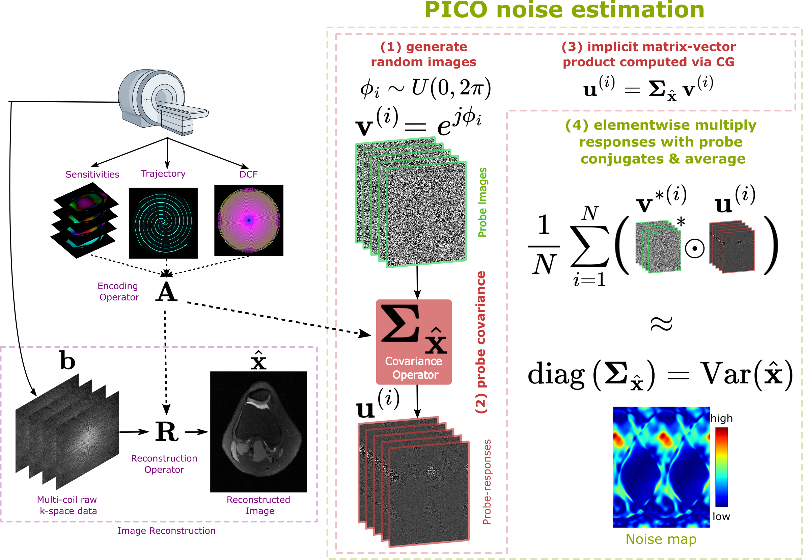

# Fast Voxelwise SNR Estimation for Iterative MRI Reconstructions

PICO toolbox for Dalmaz et al., *Fast Voxelwise SNR Estimation for Iterative
MRI Reconstructions* (submitted to *Magnetic Resonance in Medicine*, 2026).

This repository implements **PICO — Probing Image-space COvariance** —
a stochastic diagonal estimator for voxelwise noise variance maps
$\hat{\boldsymbol{\sigma}}^2_{\hat{\mathbf{x}}} = \mathrm{diag}(\boldsymbol{\Sigma}_{\hat{\mathbf{x}}})$
in linear and nonlinear MRI reconstructions. The g-factor map reported for
validation is a derived ratio (manuscript Eq. (11)) when a fully-sampled
reference is available.



## What PICO does

PICO probes the implicit covariance operator $\boldsymbol{\Sigma}_{\hat{\mathbf{x}}} = \mathbf{R}\mathbf{R}^{\mathrm{H}}$ with unit-magnitude random-phase probes $\mathbf{v}^{(i)} = e^{\mathrm{j}\theta^{(i)}}$ and estimates

$$\hat{\boldsymbol{\sigma}}^2_{\hat{\mathbf{x}}} = \frac{1}{N}\sum_{i=1}^{N} \mathbf{v}^{(i)*} \odot \big(\boldsymbol{\Sigma}_{\hat{\mathbf{x}}}\mathbf{v}^{(i)}\big)$$

(manuscript §2.2.1, Eq. (13)). The covariance–vector products reuse the same $\mathbf{A}$ / $\mathbf{A}^{\mathrm{H}}$ primitives as CG-SENSE — no separate matrix is formed — and the unit-magnitude random-phase probe attains the minimum kurtosis ($\kappa=1$) allowable for complex Hermitian operators, giving the lowest estimator variance per sample (§2.2.4). For nonlinear reconstructions (§2.2.5), PICO probes the Jacobian $\mathbf{J}_f(\mathbf{k}_0)$ via automatic differentiation. The companion baseline, Pseudo Multiple Replica (PMR; Robson 2008, §2.1), reconstructs $N$ independently-noised k-space draws and takes the voxelwise sample variance.

## Repository contents

```
fast_mri_gfactor/
├── README.md
├── environment.yml
├── pyproject.toml
├── src/mr_recon/                  # core library (unchanged)
├── experiments/
│   ├── cartesian_knee/data/       # single-slice bundle: slice120_R2.npz
│   ├── noncartesian_phantom/data/ # slice_R2_bundle.npz + raw .npy arrays
│   └── compressed_sensing/data/   # slice017_R2.npz
├── notebooks/
│   ├── 01_cartesian_knee.ipynb
│   ├── 02_noncartesian_spiral.ipynb
│   ├── 03_compressed_sensing.ipynb
│   └── assets/                    # convergence animations (Cartesian, non-Cartesian)
└── scripts/
    ├── prepare_data.py            # rebuild single-slice bundles from raw h5
    └── verify_notebooks.py        # end-to-end notebook verification
```

## Installation

```bash
conda env create -f environment.yml
conda activate mr_recon_env
pip install -e .
```

## Reproducing the paper's experiments

Three self-contained Jupyter notebooks reproduce the qualitative and
quantitative headline results from §4 of the manuscript. Convergence
animations for the two linear-reconstruction experiments show PICO
(upper row) and PMR (lower row) refining their voxelwise noise variance
estimates as the probe/replica count $N$ grows:

1. `notebooks/01_cartesian_knee.ipynb` — §4.1, Fig. 2 — linear CG-SENSE on
   retrospectively undersampled Cartesian knee data (R = 2), validated
   against the closed-form analytical SENSE reference.

   

   *(full-size animation: [`notebooks/assets/cartesian_knee_convergence.gif`](notebooks/assets/cartesian_knee_convergence.gif))*

2. `notebooks/02_noncartesian_spiral.ipynb` — §4.2, Figs. 3–4 —
   Tikhonov-regularized CG-SENSE on non-Cartesian spiral brain phantom
   data (R = 2), validated against a high-replica PMR surrogate reference
   (N = 30 000, convergence certified per Appendix D).

   

   *(full-size animation: [`notebooks/assets/noncartesian_phantom_convergence.gif`](notebooks/assets/noncartesian_phantom_convergence.gif))*

3. `notebooks/03_compressed_sensing.ipynb` — §4.3, Fig. 6 — TV-regularized
   compressed-sensing reconstruction on retrospectively undersampled
   fastMRI knee data (R = 2), validated against a method-specific high-sample
   gold reference (N = 10 000 for both PICO and PMR, Appendix D) via the
   Jacobian extension of PICO.

To regenerate the single-slice data bundles from the raw HDF5 sources:

```bash
python scripts/prepare_data.py
```

To verify all three notebooks reproduce the paper's numerical results
end-to-end:

```bash
python scripts/verify_notebooks.py
# or
pytest scripts/
```

Each notebook's final "Verification checkpoint" cell ```assert```s against
the numeric targets in manuscript Table and Figure captions (single-slice
tolerances widened relative to multi-subject averages, per the spec in
`AGENTS.md` / the companion task document).

## Data

The full multi-subject datasets used in the manuscript are large and not
redistributed here; each notebook ships with a single representative slice
(≈ 6–24 MB) sufficient to reproduce the qualitative convergence behavior of
PICO vs PMR. Sources are cited per §3.1 of the manuscript:

- Cartesian knee — Stanford knee corpus on [mridata.org](https://mridata.org/)
  (Epperson 2013); slice 120 of subject
  `efa383b6-9446-438a-9901-1fe951653dbd`.
- Non-Cartesian phantom — GE 3T Ultra High Performance spiral acquisition
  of a physical brain phantom; single slice.
- Compressed sensing — [fastMRI knee corpus](https://fastmri.med.nyu.edu/)
  (Zbontar 2018); slice 17 of subject `file1000000`.

To reproduce the full multi-subject statistics reported in Tables and Figures
of the manuscript, download the source datasets and use the existing
`scripts/run_N_comparison.py` and `scripts/plot_nonlinear_final_comparison.py`
entry points together with the SLURM templates under `slurm_scripts/`.

## Core API (`src/mr_recon/gfactor.py`)

- `gfactor_SENSE_diag(...)` — PICO for linear reconstructions (§2.2).
- `gfactor_SENSE_PMR(...)` — PMR baseline (§2.1).
- `diagonal_estimator(...)` — lower-level stochastic diagonal estimator
  (Eq. (13)).
- `incremental_diagonal_estimator(...)` — shared-probe version for
  monotonic convergence plots.
- `incremental_calc_variance_PMR(...)` — shared-replica version for
  matched comparisons.
- `gfactor_sense(mps, Rx, Ry, l2_reg)` — closed-form analytical SENSE
  g-factor used as the Cartesian reference.

The Jacobian-based PICO variant for nonlinear reconstructions (§2.2.5) is
implemented inline in `notebooks/03_compressed_sensing.ipynb` via
`torch.func.jvp`; it follows the same estimator as Eq. (13) with
$\mathbf{u}^{(i)} = \mathbf{J}_f(\mathbf{k}_0)\,\mathbf{v}^{(i)}$.

## Citation

PICO is built on top of the `mr_recon` library.

```bibtex
@inproceedings{Onat2026Sedona,
  author={Onat Dalmaz and Daniel R. Abraham and Alexander R. Toews and Akshay S. Chaudhari and  Kawin Setsompop and Brian A. Hargreaves},
  title = {Fast {SNR} and g-factor mapping for image-based iterative reconstructions},
  booktitle = {Proceedings of the ISMRM Workshop on Data Sampling and Reconstruction},
  year      = {2026},
  address   = {Sedona, USA},
}
```

## Acknowledgements
This code uses libraries from [mr_recon](https://github.com/danielabrahamgit/mr_recon) library.
